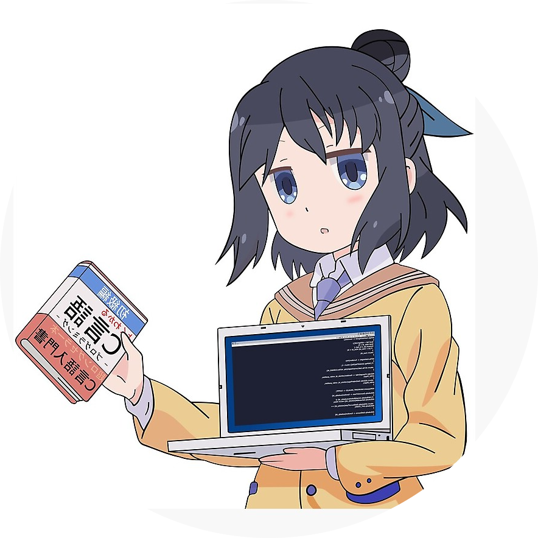

  
  <p align="center"> 
    Visitor count<br>
    
  </p>

  <h1>
    Hi, I'm Div! 
    </h2>
  </h1>


    


  <p><em>
    Upcoming Master's student at 🏛 University of Ottawa majoring in Computer Science👩‍🎓.<br>
    I’m currently learning everything... that I need to fill my gaps to become a better programmer.<br>
    I was a software developer at <a href="https://www.kochind.com/">KOCH.</a>
     
  </em></p>
  

  <br>
  A little more about me...  

  ```javascript
  const Me = {
    aka: "Div" | "April",
    work: "Student",
    favorite: "Thermocolsoup"
  }
  ```

  <hr>

  ## Skills

  <div align="center">
  
  
  
  
  </div>

  <div align="center">
  
  
  
  
  
  </div>

  <div align="center">
  
  
  
  
  
  </div>

  <div align="center">
  
  
  
  
  </div>

  <br>
  <hr>

  <h2  align="center">📫 any freelance work? do reach me on</h2>
  <p align="center">
    <a target="_blank"href="https://www.linkedin.com/in/divya-r-170906188">
    
    </a>
    &nbsp;&nbsp;&nbsp;&nbsp;
    <a href="mailto:84divr@gmail.com?subject=Hello%20Div,%20From%20Github">
    
    </a>
    &nbsp;&nbsp;&nbsp;&nbsp;
  </p>
  </h2>

  <hr>

  <!--  -->

  <!--   -->

  <!--  -->
